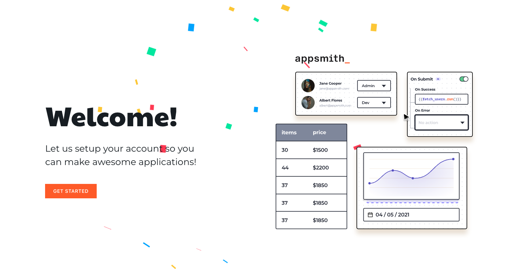
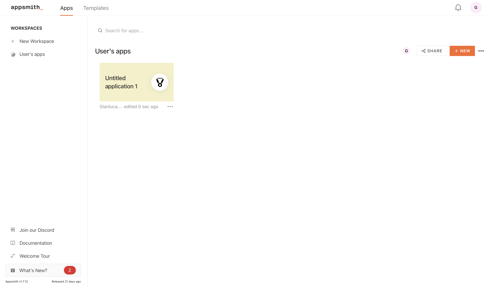

## Appsmith configuration and usage

<h2>First configuration</h2>

After the installation of the platfrom through Docker, as documented <a href="../README.md">here</a>, navigate in your browser to "localhost:80" and you'll see the welcome page of Appsmith.

Click on "Get Started" and follow the fist sign in procedure.

After the sign up, Appsmith will propose to guide you in the creation of your first app with this platform. You can follow the guide or skip directly and click on the appsmith icon on the top-left corner and go to the homepage pof the platform.

The homepage will be something like this: 

<h2>Workspaces configuration</h2>

This platform is based on 4 different applications that are based on four roles:
<ul>
  <li>Administrator
     <ul>
       <li>Can insert new courses, new users, new enterprises, accept or decline subscription requests</li>
       <li>Can modify all the applications</li>
     </ul>
  </li>
  <li>Approvers
     <ul>
       <li>Can insert new courses, accept or decline subscription requests</li>
     </ul>
  </li>
  <li>Enterprise
     <ul>
       <li>Can request a subscription to a learning course for their employees</li>
     </ul>
  </li>
  <li>Employee (User)
     <ul>
       <li>Can request a subscription to a learning course</li>
     </ul>
  </li>
</ul>

Therefore it's needed the creation of four different workspaces for each type of user, to do so click on "New Workspace" and create the four different workspaces.

Finished the creation of the workspaces, the homepage will be like the following image. 

It is possible now to import the applications in the workspaces from GitHub:
<ul>
  <li>Fork these repositories to your profile
    <ul>
      <li><a href="https://github.com/GianlucaLostuzzo/thesis_poc_admin">Admins</a></li>
      <li><a href="https://github.com/GianlucaLostuzzo/thesis-poc-approver">Approvers</a></li>
      <li><a href="https://github.com/GianlucaLostuzzo/thesis-poc-enterprise">Enterprises</a></li>
      <li><a href="https://github.com/GianlucaLostuzzo/thesis_poc_users">Users</a></li>
    </ul>
  </li>
  <li>In the corresponding workspaces, click on the options button and select <b>Import</b></li>
    
  <li>Select <b>Import from a Git repo</b></li>
  <li>Go to the forked repo and retrieve the SSH url</li>
    
  <li>Copy the SSH in Appsmith and click <b>Generate Key</b></li>
    
  <li>Copy the generated key and go to settings -> Deploy Keys on the GitHub repo</li>
    
  <li>Click on <b>Add deploy key</b>, give a name to the key, paste it, check the enable write access and click <b>Add key</b></li>
    
  <li>On Appsmith select <b>Import</b></li>
    
</ul>

