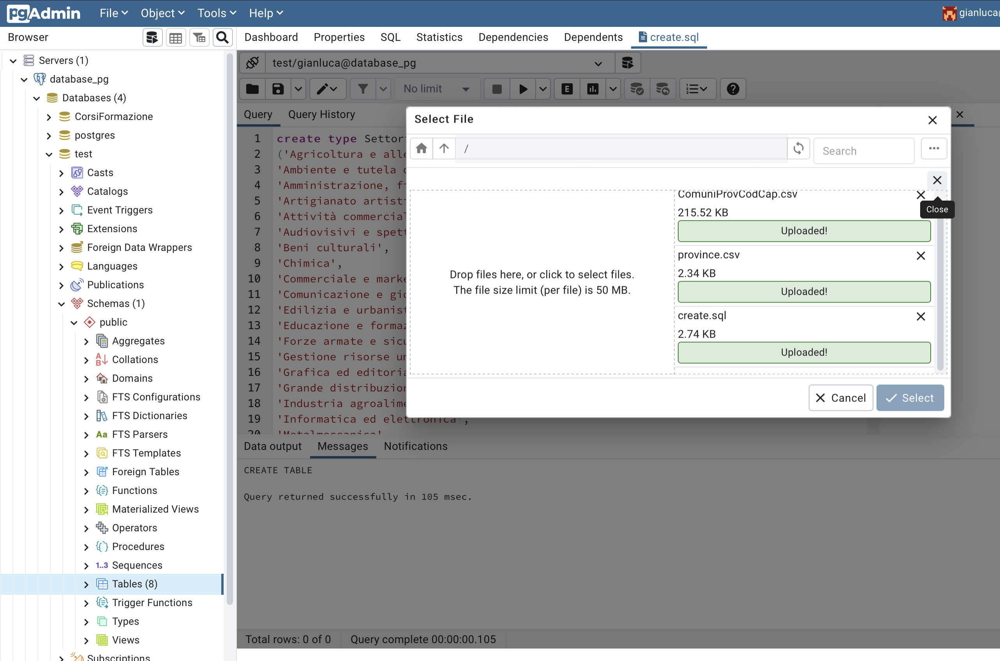
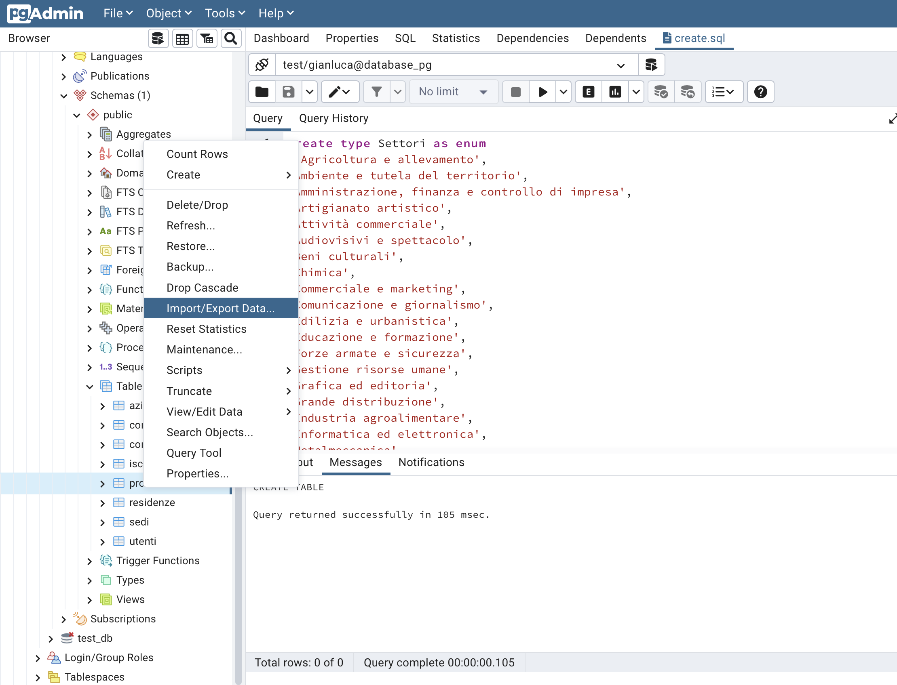
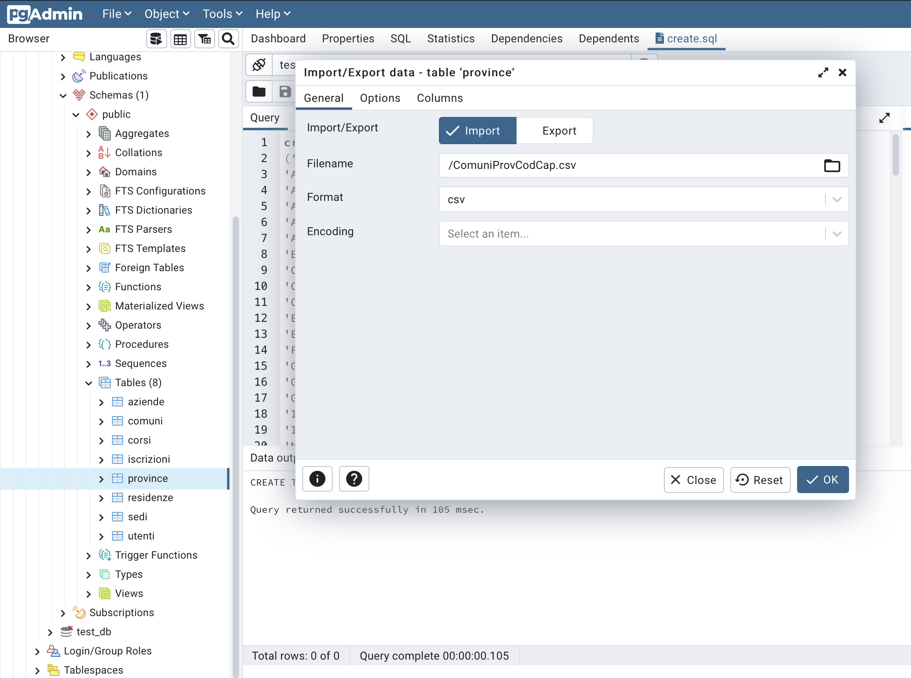
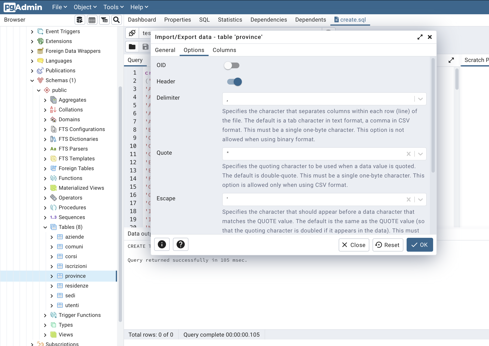

# PostgreSQL & PgAdmin 4 configuration

When the installation of the containers has finished, follow these steps to connect PgAdmin 4 with PostgreSQL:
<ul>
  <li>In your browser navigate to localhost:5050</li>
  <li>Insert the credentials for PgAdmin 4 (you can find them in the docker-compose file)</li>
  <li>Defuault credentials:</li>
  <ul><li>User: admin@admin.com</li><li>Pwd: admin</li></ul>
  <li>Click on Login</li>
</ul>

Right click on "Servers" and click Register - Server 
 

Give a name to the server 
 

Select "Connection" tab and write the name of the service "db", the username and password of PostgreSQL (docker compose file) 
 

Click "Save". Now PgAdmin is connected to PostgreSQL and it is possible to follow the final steps for correctly creating the DB.

<ul>
  <li> Download the folder "data" </li>
  <li> In PgAdmin 4:
    <ul>
      <li>Click on <b>Object</b> in the tab section </li>
      <li>Select <b>Create -> Database </b></li>
        
      <li>Give the name to the database ("Corsi di formazione") and <b>save</b></li>
      <li>Right click on the name of the created database</li>
      <li>Select <b>Query Tool</b></li>
        
      <li>Click on the folder icon then on the options icon and finally click <b>Upload</b></li>
        
      <li>Drag and drop (or select) the files present in the folder "data" previously downloaded</li>
      <li>Click on the close window button</li>
        
      <li>Select "create.sql" and click on "Select"</li>
      <li>Click on the first row</li>
      <li>Select all the rows (Ctrl+A, Command+A)</li>
      <li>Click on the play icon for creating all the tables and types needed</li>
        
      <li>Explode "Schemas" in the database tree on the left</li>
      <li>Explode "Tables"</li>
      <li>Right click on "Province" and click on <b>Import/Export Data</b></li>
        
      <li>Select "ComuniProvCodCap.csv" file</li>
        
      <li>Enable the "header" option in the Options section and set the Delimiter as comma (,)</li>
        
      <li>Verify in the Column section that the sequence of columns is exactly regione, nome, codice </li>
      <li>Click <b>Ok</b></li>
    </ul>
  </li>
</ul>
